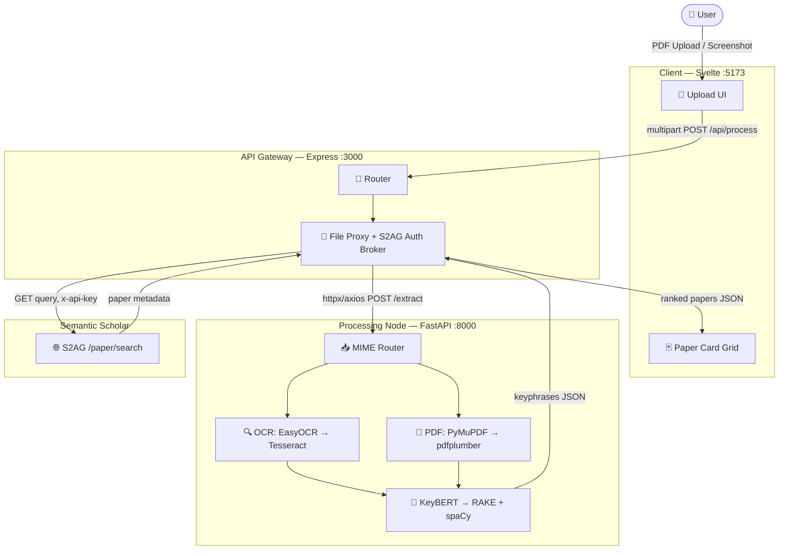
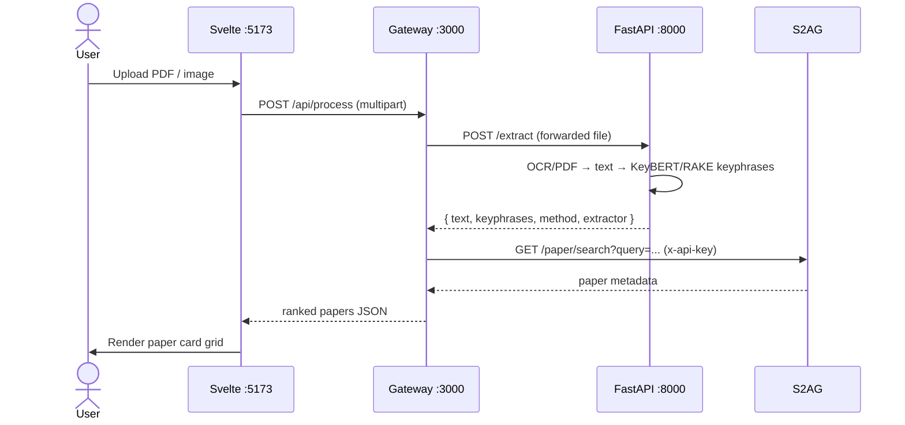

# Contextual Research Recommender — Smart Reading Companion

> **An NLP-powered reading companion.** Upload a PDF or a screenshot of what you're
> reading; the system extracts the text, distills it into **5–7 keyphrases**, queries
> the **Semantic Scholar Academic Graph (S2AG)**, and returns a ranked grid of the
> papers you should read next.

**Core promise:** *From the paragraph in front of you to the five papers you should read next — in one step.*

---

## Table of Contents

- [System Overview](#system-overview)
- [Architecture](#architecture)
- [Repository Layout](#repository-layout)
- [The Pipeline & Tech Choices](#the-pipeline--tech-choices)
- [Installation](#installation)
  - [Prerequisites](#prerequisites)
  - [Environment Variables](#environment-variables)
  - [Service Setup](#service-setup)
- [Running the System](#running-the-system)
- [API Reference](#api-reference)
- [Testing](#testing)
- [Evaluation & Metrics](#evaluation--metrics)
- [Scope & Status](#scope--status)

---

## System Overview

A three-tier distributed system that bridges your reading material with the global
academic knowledge base:

```
Document Ingestion → OCR / PDF Extraction → NLP Keyphrase Distillation → S2AG Search → Card Grid UI
```

| Tier | Tech | Port | Responsibility |
|------|------|------|----------------|
| **Frontend** | Svelte (SvelteKit) + Vite | 5173 | File-upload UI + reactive paper-card grid (neubrutalist design) |
| **API Gateway** | Express.js (Node 18+) | 3000 | Routing, file proxy, **S2AG auth broker** (holds the API key) |
| **Processing Node** | FastAPI (Python 3.10+) | 8000 | OCR, PDF parse, keyphrase extraction. **Internal-only.** |
| **External** | Semantic Scholar (S2AG) | — | Paper search + metadata |

> [!IMPORTANT]
> **Security rule:** the S2AG API key lives **only** in the gateway. The processing
> node is never publicly exposed, and the frontend never sees the key.

---

## Architecture



**Request flow:** the browser only ever talks to the gateway. The gateway forwards the
file to the internal engine, receives the unified text + keyphrases, queries S2AG with
its held key, normalises the results, and returns them to the client.

---

## Repository Layout

```
Comp_Project/
├── instructions.md          # build spec (source of truth)
├── UI_INSTRUCTIONS.md       # neubrutalist UI spec
├── README.md                # this file
├── .env.example             # combined env template
│
├── frontend/                # Svelte + Vite (SvelteKit)
│   └── src/
│       ├── app.css          # design tokens (neubrutalism)
│       ├── routes/+page.svelte
│       └── lib/
│           ├── api.js       # talks to gateway /api/process
│           ├── theme.js     # dark/light dual-tone store
│           └── components/  # Nav, Hero, PaperCard, Uploader, Carousel, ...
│
├── backend/                 # Express.js gateway
│   ├── server.js / app.js
│   ├── config/index.js      # holds S2AG key
│   ├── routes/process.js    # POST /api/process orchestration
│   ├── services/
│   │   ├── engine.js        # proxy → processing node /extract
│   │   ├── s2ag.js          # Semantic Scholar client
│   │   └── cache.js         # TTL cache (identical requests)
│   ├── middleware/error.js
│   └── tests/               # jest + supertest + nock
│
└── processing/              # FastAPI processing node
    ├── main.py              # FastAPI app, POST /extract, /health
    ├── config.py            # pydantic-settings
    ├── services/
    │   ├── ingestion.py     # MIME router
    │   ├── pdf_parser.py    # PyMuPDF → pdfplumber
    │   ├── ocr.py           # EasyOCR → pytesseract
    │   └── keywords.py      # KeyBERT → RAKE
    ├── utils/preprocess.py  # spaCy stop-words / n-grams
    ├── models/schemas.py    # pydantic models
    ├── eval/                # CER / P@5 / NDCG scripts + fixtures
    └── tests/               # pytest
```

---

## The Pipeline & Tech Choices

The data journey is five sequential stages (instructions.md §5). Both extraction paths
converge on a **single unified raw-text string** before reaching the NLP core.

| Stage | Primary | Fallback | Why |
|-------|---------|----------|-----|
| **PDF parse** | PyMuPDF (`fitz`) | pdfplumber | Ordered text layer, millisecond-scale |
| **Image OCR** | EasyOCR | pytesseract (Tesseract 5) | Robust deep-learning OCR; Tesseract guarantees availability |
| **Keyphrases** | KeyBERT + `all-MiniLM-L6-v2` | RAKE (rake-nltk) | Semantic ranking; RAKE for long / low-signal text or offline |
| **Preprocess** | spaCy (`en_core_web_sm`) | blank `en` tokenizer | Stop-word filtering, n-grams (1–3) |

> [!NOTE]
> Each tier degrades gracefully: if the primary engine is unavailable in your
> environment (e.g. EasyOCR has no wheel for your Python version), the fallback is used
> automatically and the response's `method` / `extractor` fields tell you which ran.

---

## Installation

### Prerequisites

| Runtime | Version | Install |
|---------|---------|---------|
| Node.js | 18+ LTS | https://nodejs.org |
| Python | 3.10+ | https://python.org |
| Tesseract OCR | 5.x | `brew install tesseract` / `apt install tesseract-ocr` |

### Environment Variables

Copy `.env.example` into the two service `.env` files (already scaffolded):

**`backend/.env`** — gateway (holds the key)
```env
PORT=3000
FASTAPI_URL=http://localhost:8000
S2AG_API_KEY=                # leave empty for unauthenticated S2AG
S2AG_BASE_URL=https://api.semanticscholar.org/graph/v1
```

**`processing/.env`** — engine (no secrets)
```env
HOST=0.0.0.0
PORT=8000
KEYBERT_MODEL=all-MiniLM-L6-v2
MIN_KEYWORDS=5
MAX_KEYWORDS=7
TESSERACT_CMD=/opt/homebrew/bin/tesseract
```

> [!WARNING]
> Never commit a populated `S2AG_API_KEY`. The repo `.gitignore` already excludes
> `.env`. The key is **optional** — an empty value calls S2AG unauthenticated at a
> lower rate limit.

### Service Setup

```bash
# 1) Processing node (FastAPI)
cd processing
python -m venv venv && source venv/bin/activate    # Windows: venv\Scripts\activate
pip install -r requirements.txt
python -m spacy download en_core_web_sm
uvicorn main:app --host 0.0.0.0 --port 8000 --reload

# 2) API gateway (Express)
cd backend && npm install
npm run dev                                          # http://localhost:3000

# 3) Frontend (Svelte)
cd frontend && npm install
npm run dev                                          # http://localhost:5173
```

The first `/extract` call downloads the `all-MiniLM-L6-v2` model (~80 MB) and NLTK data
for RAKE; both are cached afterwards.

---

## Running the System



Open `http://localhost:5173` with all three services running.

---

## API Reference

### `POST /api/process` — gateway (public)

`multipart/form-data`: `file=<PDF|image>`, optional `maxResults` (default 5, max 10).

```bash
curl -X POST http://localhost:3000/api/process \
  -F "file=@/path/to/document.pdf" -F "maxResults=5"
```

**200 Response**
```json
{
  "status": "success",
  "keyphrases": ["transformer attention mechanism", "bert language model"],
  "query": "transformer attention mechanism bert language model",
  "method": "pymupdf",
  "extractor": "keybert",
  "total_results": 5,
  "papers": [
    {
      "paperId": "204e30...",
      "title": "Attention Is All You Need",
      "abstract": "…",
      "authors": [{ "authorId": "1701686", "name": "Ashish Vaswani" }],
      "year": 2017,
      "citationCount": 98423,
      "url": "https://www.semanticscholar.org/paper/204e30...",
      "venue": "NeurIPS"
    }
  ]
}
```

**Error Response**
```json
{ "status": "error", "code": "ENGINE_UNAVAILABLE", "message": "NLP engine is unreachable" }
```

### `POST /extract` — processing node (internal)

`multipart/form-data`: `file=<PDF|image>`. Returns:
```json
{ "text": "unified raw text…", "keyphrases": ["…"], "method": "pymupdf|pdfplumber|easyocr|tesseract", "extractor": "keybert|rake", "raw_text_length": 4821 }
```

Both services also expose `GET /health`.

---

## Testing

The build was delivered in blocks, each unit-tested, then integration-tested, then a
full regression pass.

| Suite | Command | Covers |
|-------|---------|--------|
| **Engine (unit + integration)** | `cd processing && ./venv/bin/python -m pytest` | ingestion, OCR/PDF, KeyBERT/RAKE, spaCy, `/extract`, eval metrics |
| **Gateway (unit + integration)** | `cd backend && npm test` | s2ag client, `/api/process` orchestration, **real-engine E2E** |
| **Frontend (unit + integration)** | `cd frontend && npm test` | `api.js` client, `PaperCard` rendering |
| **Frontend build** | `cd frontend && npm run build` | production build / regression gate |

The gateway suite includes `tests/integration.test.js`, which spawns the **real FastAPI
engine** as a subprocess and drives the full `gateway → engine → (mocked) S2AG` chain.
It auto-skips if the engine virtualenv is absent.

---

## Evaluation & Metrics

Reproducible metrics against labelled fixtures (instructions.md §9):

```bash
cd processing && ./venv/bin/python -m eval.run_eval
```

| Metric | Target | Meaning |
|--------|--------|---------|
| **CER** | < 5% | Character Error Rate of extraction vs ground truth |
| **Precision@5** | ≥ 0.80 | Fraction of top-5 papers judged relevant |
| **NDCG@5** | ≥ 0.75 | Ranking quality (rewards relevant hits near the top) |

Fixtures live in `processing/eval/fixtures/`; swap the predictions for live extractor
output to benchmark a real pipeline.

---

## Scope & Status

**In scope:** PDF extraction, screenshot OCR, real-time keyphrase distillation, S2AG
fetch & ranking, responsive neubrutalist card-grid UI.

**Out of scope:** full-text PDF hosting, citation-graph traversal, user accounts/auth,
offline on-device inference, handwritten / multi-language OCR.

**On hold (by request):** model training & fine-tuning — the system uses the pretrained
`all-MiniLM-L6-v2` model as-is.

---

*Built with the Semantic Scholar Academic Graph API. Not affiliated with or endorsed by
the Allen Institute for AI.*
